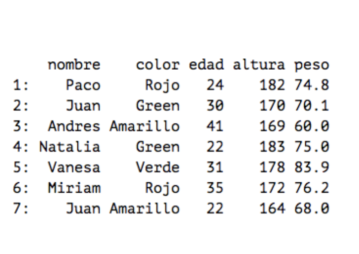

# Introducción

Cualquier problema de Machine Learning (data-mining, text-analysis, sentiment-analysis…) contiene las siguientes fases:


## Tipos de datos

### No estructurados


### Estructurados

* CSV


* JSON


## Fuentes de datos

Algunos ejemplos gratuitos de fuentes de datos estructurados y no estructurados que se pueden encontrar en Internet

[https://www.kaggle.com/datasets](https://www.kaggle.com/datasets)

[https://www.google.com/publicdata/directory](https://www.google.com/publicdata/directory)

[https://registry.opendata.aws/](https://registry.opendata.aws/)

[https://www.reddit.com/r/datasets/](https://www.reddit.com/r/datasets/)

[https://datos.gob.es](https://datos.gob.es)

# ¿Qué vamos a hacer?

La primera parte del taller consistirá en desarrollar en código Python este diagrama básico de obtención de datos a través de Twitter. Los datos serán _tweets_ de la red social y los recibiremos estructurados. Después los exportaremos a un fichero CSV.


La segunda parte del taller consistirá en limpiar esos datos, trabajar con funciones básicas de Natural Language Processing y analizar el sentimiento de los tweets a través de librerías de Python como Textblob o MeaningCloud.

## Requisitos

* Python 3.6 o superior
* Jupyter Notebooks (o Anaconda)
* Editor de código o IDE
 
Revisa tu(s) versión(es) instaladas de Python con el siguiente comando. Si tienes dos versiones diferentes instaladas, seguramente Python 3.6 esté asociado al segundo.
```bash
python --version
python3 --version
```
Para saber dónde está instalada tu versión de Python escribe en la Terminal:
```bash
which python
```

## Librerías de Python

Las librerías recomendadas para este taller son las siguientes:

* tweepy
* pandas
* python-csv
* nltk
* wordcloud
* textblob
* meaningCloud-python

Puedes instalarlas con 
```bash
pip install <nombre libreria>
```

Revisa que están instaladas correctamente con el siguiente comando:
```
pip list
```

# Índice de contenidos

1. [Cómo conseguir una cuenta de desarrollador en Twitter](./twitter-account.html).

1. [Cómo crear tu primera app de Twitter](./twitter-app.html).

1. [Intro Python](./intro-python.html)

1. [Intro Pandas](./pandas-csv.html)

1. [Tipos de extracción de datos](./extraccion-datos.html)

1. [Búsqueda simple](https://drive.google.com/file/d/1G1G2MpUZDAIl91EEPX76sqOZWMdUxFLS/view?usp=sharing)

1. [Streaming](https://drive.google.com/file/d/1BwVY-fIG1nsu6KwewZNZRio5ZFu2CpSD/view?usp=sharing)

1. [Limpieza de textos](https://colab.research.google.com/drive/1QfdVEejIknXRw-OTEmKHziRJkpvZU8Dy)

1. [Sentiment](https://drive.google.com/file/d/1q3gVlWkd6bD_5lknXh5FkiiO0prBx7Og/view?usp=sharing)
