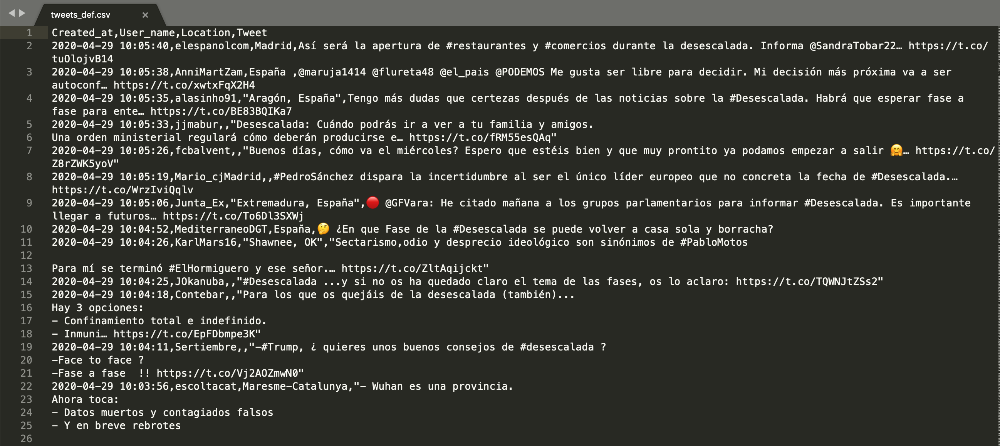

# Jugando con Pandas y ficheros JSON y .CSV

Aprende la estructura de los ficheros CSV y JSON y cómo procesarlos utilizando la librería Pandas. 

## El fichero CSV

El significado de sus siglas equivale a "Comma Separated Value", o sea es un fichero en el que cada valor se separa por comas. En trabajos basados en datos, la fila 0 se utiliza para definir los atributos. Así, las columnas quedarán claramente representadas cuando esas comas hagan de separadores. 

Aquí puedes ver un fichero CSV leído en texto plano:




Aquí puedes ver la versión que procesa Pandas:


El fichero CSV también se puede generar desde cero muy fácilmente con Pandas. 

## El fichero JSON

El significado de sus siglas es JavaScript Object Notation, o sea es un fichero que almacena estructuras de datos y objetos en el formato que define el lenguaje JavaScript. 

Seguramente los hayas visto y jugado con ellos si has trabajado con peticiones API o aplicaciones web. Es la forma que se ideó para enviar datos del servidor a la aplicación web. Tiene la siguiente estructura jerárquica:

```json
{
  "statuses": [
    {
      "created_at": "Mon May 06 20:01:29 +0000 2019",
      "id": 1125490788736032770,
      "id_str": "1125490788736032770",
      "text": "Today's new update means that you can finally add Pizza Cat to your Retweet with comments! Learn more about this ne… https://t.co/Rbc9TF2s5X",
      "truncated": true,
      "entities": {
        "hashtags": [],
        "symbols": [],
        "user_mentions": [],
        "urls": []
      }
    }
  ]
}
```

Puedes leer y probar más en [W3 Schools JSON](https://www.w3schools.com/js/js_json_objects.asp)

Cualquier estructura JSON se puede iterar facilmente con Python para filtrar la cantidad de información recibida o generar una estructura nueva.  

## Introducción a Pandas
Como en cualquier código Python, el primer paso es importar la librería que queremos utilizar
```python
import pandas as pd
```

+ **Leer un CSV**

```python
data = pd.read_csv("tweets_def.csv") 
data.head(10)
```

+ **Averiguar el tipo de variable**

```python
type(data)
```

El ejemplo anterior nos devolverá como respuesta  `pandas.core.frame.DataFrame`

+ **Utilizar estructura diccionario**

En Python, las estructuras llamadas diccionarios nos ayudan a estructurar información que esté compuesta por columnas y filas de información. En Pandas, la estructura que se acopla perfectamente a la de diccionario se llama DataFrame. 

```python
dict_ = {'user': [], 'user_location': [], 'date_created': [], 'text': [], 'retweet_count': [], 'favorite_count': [], 'hashtags': [], 'user_mentions': [], 'urls': []}        

df = pd.DataFrame(dict_)  

```


+ **Volcar la información a un fichero .CSV**


```python
df.to_csv(path_or_buf = "twitter_stream.csv", mode="a", header=False, encoding="utf-8")
```


<div class="center">

<blockquote class="twitter-tweet"><p lang="en" dir="ltr">PROTIP: wanna get data from your Google Sheet into Python/R/etc? Don&#39;t mind if the data has a public link? It&#39;s as easy as this: <a href="https://t.co/DBlewp8XVF">pic.twitter.com/DBlewp8XVF</a></p>&mdash; Chris Holdgraf (@choldgraf) <a href="https://twitter.com/choldgraf/status/1141436794359046144?ref_src=twsrc%5Etfw">June 19, 2019</a></blockquote> <script async src="https://platform.twitter.com/widgets.js" charset="utf-8"></script>

</div>


[Volver a inicio](./)
